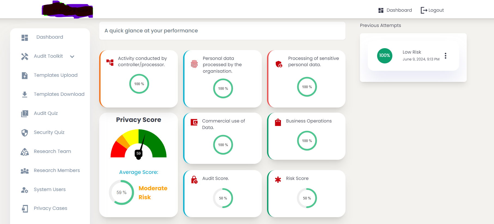

# Audit Toolkit
This project delivers a user-friendly platform to empower organizations with self-assessment tools and reporting functionalities for managing risk and data privacy.  

### Key Features:
1. **Secure Login:** Ensures authorized access to the platform.  
2. **Centralized Dashboard:** Provides a clear overview of risk assessments and data privacy compliance efforts.  
3. **Risk Score Questionnaire:** Streamlines the identification and evaluation of potential risks within your organization.  
4. **Self-Assessment Questionnaires:**  
5. **Data Privacy Audit:** Guides users through a comprehensive self-assessment of data privacy practices.  
6. **Data Protection Impact Assessment (DPIA):** Facilitates the creation of a DPIA report, a crucial step for processing high-risk personal data.  
7. **Downloadable Reports:** Enables users to generate and download reports for internal documentation and record-keeping purposes.
This platform empowers organizations to proactively manage risk and enhance data privacy compliance by offering a centralized hub for self-assessment tools and reporting capabilities.
